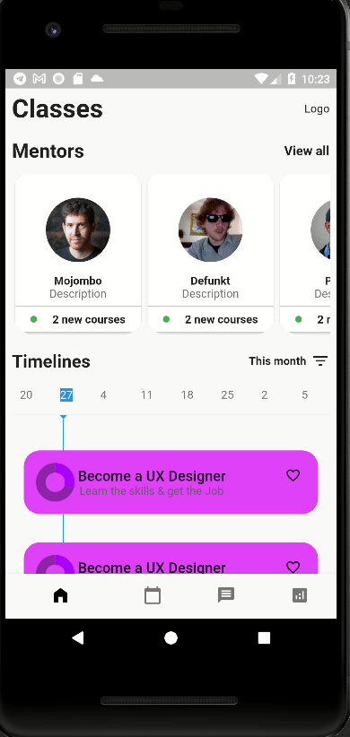
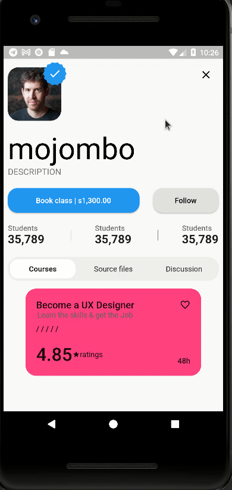

# orbis_task

Examination project.

## What should be included in the next version?
* Enrich the project with more data from the GitHub OpenAPI for each user with his projects. I 
started to do it but the api is not stable, many times i'm not getting
any data, maybe because they are restrictions in some cases to don't go many
requests from same devices for testing purpose, idk.
* Add background card on each Specification card to be exactly like the design.
It can be done with a simple card with a background that is wrapped with Stack
* The theme can be separated globally
* The listing should be infinite scroll
* When the data is populated it's just be changed with the real one. Also in the timeline manager
it would be good if it's added more detail data which will centralized the cards
according to it. For example:
```
{
    "id": "1",
    "title": "Card 1",
    "description": "Card 1 description",
    "start": "2020-01-01",
    "end": "2020-01-02",
    "type": "specification",
    "background": {
        "color": "red",
        "image": "https://picsum.photos/200/300"
    }
}
```

### Where to find the latest prototype features
* On "dev" branch
### Where to find the latest stable features
* On "master" branch

## DEMO

#### User:
- List users
  <p></p>
- Profile page
  <p></p>
